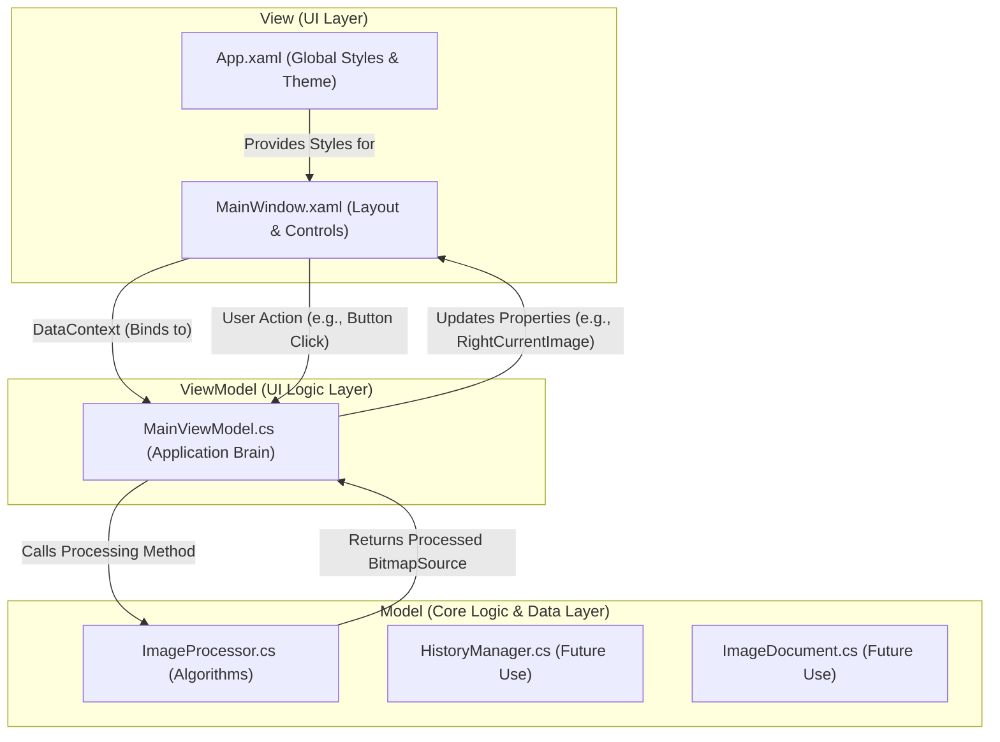

```mermaid
graph TD
    subgraph View["View (UI Layer)"]
        direction LR
        App_xaml["App.xaml (Global Styles & Theme)"]
        MainWindow_xaml["MainWindow.xaml (Layout & Controls)"]
    end

    subgraph ViewModel["ViewModel (UI Logic Layer)"]
        direction LR
        MainViewModel["MainViewModel.cs (Application Brain)"]
    end

    subgraph Model["Model (Core Logic & Data Layer)"]
        direction LR
        ImageProcessor["ImageProcessor.cs (Algorithms)"]
        HistoryManager["HistoryManager.cs (Future Use)"]
        ImageDocument["ImageDocument.cs (Future Use)"]
    end

    %% --- Connections ---
    
    %% View -> ViewModel
    MainWindow_xaml -- "DataContext (Binds to)" --> MainViewModel
    App_xaml -- "Provides Styles for" --> MainWindow_xaml
    MainWindow_xaml -- "User Action (e.g., Button Click)" --> MainViewModel

    %% ViewModel -> Model
    MainViewModel -- "Calls Processing Method" --> ImageProcessor

    %% Model -> ViewModel
    ImageProcessor -- "Returns Processed BitmapSource" --> MainViewModel

    %% ViewModel -> View (via Data Binding)
    MainViewModel -- "Updates Properties (e.g., RightCurrentImage)" --> MainWindow_xaml

```