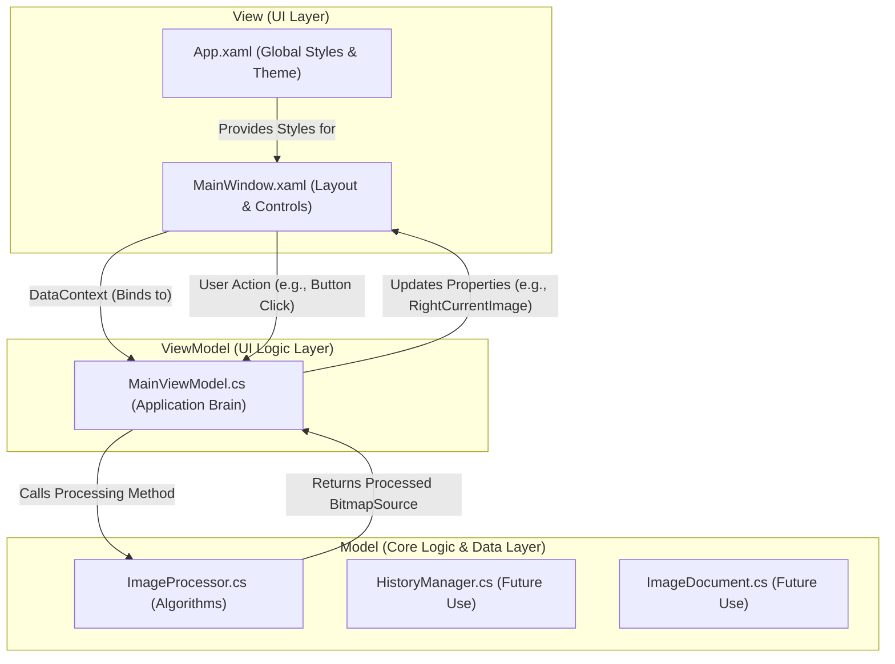

### **프로젝트 ImaGy: 진행 상황 및 계획 요약**

**1. 프로젝트 목표**
*   WPF와 C#을 사용하여 `README.md` 명세서에 기술된 이미지 처리 및 분석 애플리케이션을 개발합니다.

**2. 현재까지 완료된 작업 (Current Status)**
*   **MVVM 아키텍처 설정**: Model-View-ViewModel 패턴으로 프로젝트 구조를 설정했습니다.
*   **UI 레이아웃 구현**: `README.md`에 명시된 대로 메뉴, 상태바, 3단 그리드(원본/결과/패널) 구조의 `MainWindow` UI를 구현했습니다.
*   **다크 테마 적용**: `App.xaml`에 어두운 회색 계열 배경과 보라-파랑 계열 포인트 색상을 사용하는 전역 스타일을 적용하여 세련된 다크 테마를 완성했습니다.
*   **핵심 기능 구현**:
    *   이미지 열기 (`Ctrl+O`) 및 저장 (`Ctrl+S`) 기능 구현.
    *   첫 번째 이미지 처리 기능으로 **이진화(Binarization)**를 구현했습니다.
    *   이미지 처리 작업에 대한 **실행 취소(Undo) / 다시 실행(Redo)** 기능을 스택(Stack)을 이용하여 구현했습니다.
*   **버그 수정 및 안정화**: XAML 파싱 오류, 스타일 간섭, 코딩 스타일 불일치 등 여러 이슈를 해결하여 현재 빌드가 성공하고 안정적으로 실행되는 상태입니다.

**3. 향후 계획 (Future Plans)**
1.  **이미지 처리 기능 추가**: `README.md`에 명시된 다른 기능들을 `ImageProcessor.cs`에 순차적으로 추가합니다.
    *   **1순위 (기본 처리)**: 평활화(Smoothing), 자르기(Crop)
    *   **2순위 (필터링)**: 샤프닝(Sharpening), 블러(Blur), 엠보싱(Embossing)
    *   **3순위 (형태학)**: 팽창(Dilation), 침식(Erosion)
2.  **UI 개선**:
    *   이미지 처리 기능에 필요한 파라미터(예: 이진화의 Threshold 값)를 사용자가 직접 입력할 수 있도록 슬라이더나 숫자 입력 필드를 UI에 추가합니다.
    *   `HistoryItems`와 Undo/Redo 로직을 연동하여, Undo 시 작업 내역이 함께 제거되도록 개선합니다.
3.  **고급 기능 구현**:
    *   히스토그램(Histogram) 시각화 기능을 구현합니다.
    *   템플릿 매칭(Template Matching) 기능을 구현합니다.
4.  **성능 최적화 (장기)**:
    *   `README.md`에 언급된 대로, 성능이 중요한 처리 기능은 C++ 라이브러리로 구현하여 연동하는 방안을 검토합니다.

**4. 애플리케이션 아키텍처 (Mermaid 코드 형식)**

